# Water & Wastewater Domain V1

## Scope

Water & Wastewater is a first-class UtilitiesPlatform domain family. Water and wastewater retain separate canonical identifiers, taxonomies, rule profiles, traces, proposals, and work types while sharing the same source-review, asset, relationship, QA, trace, proposed-edit, work-order, and audit architecture used by Electric Distribution and Telecom/Fiber.

The implementation is vendor-neutral. It does not require or reproduce Esri Utility Network, ArcFM, Smallworld, WaterGEMS, SewerGEMS, InfoWater, InfoWorks, or another licensed utility platform.

```mermaid
flowchart LR
    A["Registered source metadata"] --> B["Conservative inspection"]
    B --> C["Human taxonomy review"]
    C --> D["Canonical asset and relationship model"]
    D --> E["Immutable connectivity QA"]
    E --> F["Read-only topology trace"]
    F --> G["Proposed edit overlay"]
    G --> H["Work order and job package"]
    H --> I["Future licensed-system adapter"]
```



No stage automatically authorizes the next one. Human review remains required, and none of these workflows edits source or staged geometry.

## Domain Model

Stable identifiers are:

- `water`
- `wastewater`
- `water_wastewater`
- `multi_utility`
- `unknown`

The canonical core keeps identity, geometry metadata, lifecycle and operational state, ownership, source lineage, QA and review state, sensitivity, confidence, evidence, and explicit relationships. Water and wastewater attributes extend that core; they do not create parallel databases.

Source packages may contain one domain, both domains, several utility domains, or ambiguous layers. Classification uses names, aliases, geometry, fields, domains, subtypes, relationships, coordinate evidence, and ownership evidence. High-confidence classification requires corroboration. Generic sewer lines, unclear facilities, and gravity-versus-force-main candidates remain provisional.

## Taxonomy

Water supports mains, transmission and distribution mains, service and hydrant laterals, raw and reclaimed water lines, valves, hydrants, meters, fittings, pumps, stations, storage, treatment, wells, backflow devices, sensors, sampling points, structures, pressure zones, service areas, boundaries, easements, and facility sites.

Wastewater supports gravity mains, force mains, pressure sewers, laterals, interceptors, trunk sewers, outfalls, manholes, cleanouts, junctions, lift stations, pumps, wet wells, treatment, monitoring and sampling points, valves, structures, sewer basins, collection and treatment areas, boundaries, easements, and overflow areas.

A polyline is never classified as gravity flow from geometry alone. Node identifiers, inverts, slope, direction, lift-station context, pressure indicators, and explicit relationships are retained as evidence rather than invented.

## Source Review

The shared Data Sources workspace filters All, Electric, Telecom, Water, Wastewater, Multi-utility, and Unknown sources. Safe summaries expose aggregate domain evidence, candidate counts, ambiguities, coordinate blockers, sensitivity, duplicate candidates, ownership uncertainty, staging readiness, and review counts.

Inspection is read-only. It does not project data, define a coordinate system, repair geometry, snap endpoints, reverse flow, merge duplicates, create assets, publish data, or export restricted records.

Registered local source packages remain outside Git under the configured runtime root. Public responses and browser bundles omit source paths, raw records, coordinates, credentials, and restricted attributes.

## Connectivity QA

Water uses 18 rules (`WATER-001` through `WATER-018`) covering identity, geometry metadata, coordinates, dimensions, material, lifecycle, explicit main/service/hydrant/valve relationships, pressure-zone and facility references, ownership, retired-only connectivity, service endpoints, and system identity.

Wastewater uses 20 rules (`WW-001` through `WW-020`) covering identity, geometry metadata, coordinates, gravity structures, identical endpoints, dimensions, material, slope and invert evidence, gravity/pressure contradictions, laterals, manholes, lift stations, retired-only connectivity, basin/system references, and ownership.

Rules are conservative. Missing semantic evidence produces `unable_to_determine` or a clearly skipped execution when the rule cannot be supported. Findings are immutable review candidates, not automatic repairs or confirmed defects.

## Topology Traces

Water profiles provide:

- connected assets from a main
- upstream source or facility path
- service and hydrant reachability
- valve-isolation impact
- affected services after simulated valve closure
- disconnected-asset identification

Wastewater profiles provide:

- downstream gravity path
- upstream contributing assets
- path to lift station
- force-main path
- path to treatment or outfall
- affected upstream assets after a simulated blockage
- disconnected-structure identification

**This is a topology/connectivity trace and not a hydraulic simulation.**

Traces use explicit canonical relationships, lifecycle state, represented device state, deterministic bounds, and immutable receipts. They report missing or provisional evidence and never operate equipment, calculate pressure or flow, edit geometry, or claim authoritative topology.

## Proposed Changes And Work

The existing proposed-edit engine accepts allowlisted Water and Wastewater operations for mains, valves, hydrants, services, meters, manholes, laterals, lift-station relationships, flow and elevation metadata, retirements, and connectivity review. Every change remains an isolated, nonexecutable overlay.

The existing work-order engine supplies Water and Wastewater work-type and inspection catalogs. Synthetic demo scenarios cover main, hydrant, valve, service, meter, gravity-main, manhole, lateral, lift-station, force-main, invert, abandonment, and blockage workflows. Local startup deliberately does not seed Water or Wastewater work orders into the real application registry.

## Adapter Boundaries

`nrel_smart_ds` validates a small allowlisted import manifest and returns candidate Electric mappings in dry-run mode. It reads no external records, downloads nothing, and creates no assets. The contract anticipates line voltage, load, transformer, capacitor, regulator, protective-device, switch, source, phase, feeder, and nominal-voltage concepts.

Telecom context adapters distinguish planning context, service availability, funding area, and reference boundaries from operational OSP inventory. FCC availability, state eligibility, grant areas, and provider coverage cannot create cables, closures, handholes, cabinets, splitters, terminals, or service drops.

## Local And Demo Operation

Local mode uses FastAPI and the existing external application registry. The runtime root defaults to the approved local configuration and remains outside Git. No additive database migration was required because existing canonical, QA, trace, proposal, and work-order records already store allowlisted vertical values and versioned JSON evidence.

The static portfolio demo creates deterministic Water and Wastewater assets and relationships in the browser. Review, trace, proposal, and work-order state uses `sessionStorage` and resets with the demo session. Demo mode makes no backend requests and contains no real names, coordinates, identifiers, paths, or schemas.

Routes:

- `/utilities/water-wastewater`
- `/utilities/water-wastewater/assets`
- `/utilities/water-wastewater/connectivity-qa`
- `/utilities/water-wastewater/network-trace`
- `/utilities/water-wastewater/proposed-edits`
- `/utilities/water-wastewater/work-orders`

Use `?system=water` or `?system=wastewater` to preserve the selected system.

Safe APIs:

- `GET /api/utility-domains/water-wastewater/summary`
- `GET /api/source-adapters`
- `POST /api/source-adapters/{source_type}/inspect`
- existing `/api/utility-assets`, `/api/connectivity-qa`, `/api/network-trace`, `/api/proposed-edits`, and `/api/work-orders` routes with `water` or `wastewater`

## Development

```powershell
powershell -ExecutionPolicy Bypass -File scripts\local\start-local-platform.ps1
cd frontend
npm run lint
npx tsc --noEmit
npm run build
npm run test:e2e
npm run test:a11y
npm run test:demo
cd ..
python -m pytest backend\tests
python -m pytest tests
python scripts\validate_local_storage.py
python scripts\data_storage\validate_data_storage.py
```

The local developer runtime root is `C:\UtilitiesPlatform_Data`. Static demo state is `sessionStorage`; the public build never receives that local path.
